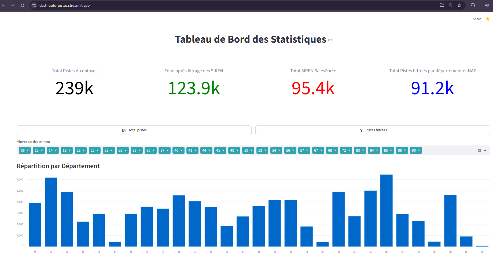
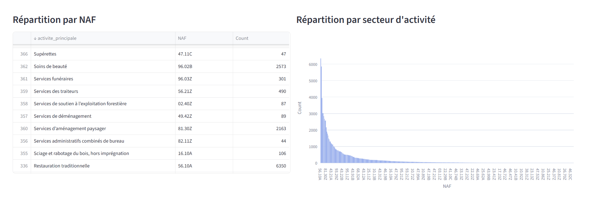
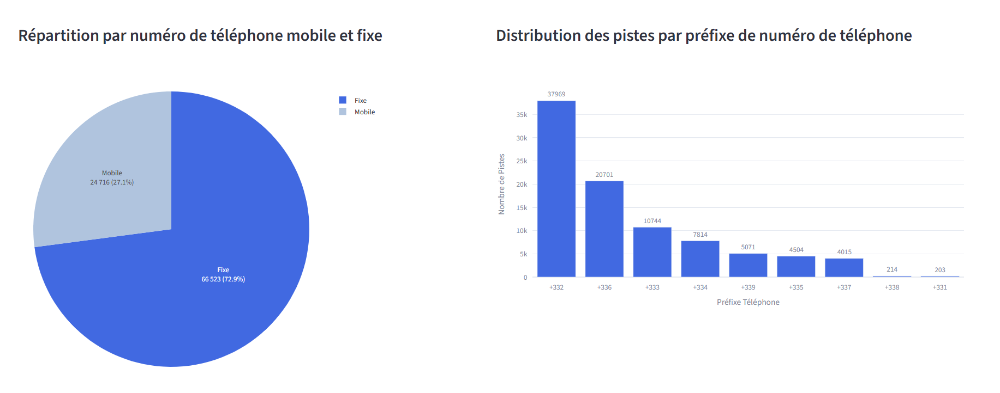

# Auto Piste Analytics Dashboard – Real-Time Lead Intelligence

An **interactive Streamlit-based dashboard** that provides **real-time insights into lead quality**, **conversion potential**, and **campaign performance** from the **Auto Piste platform**. The dashboard features **dynamic KPI visualizations** and advanced filtering to support **strategic decision-making**.

---

## Features

- **Real-time Data**: Visualize live metrics from your lead intelligence platform.
- **Lead Quality**: Track lead quality scores to prioritize high-value prospects.
- **Conversion Potential**: Analyze the likelihood of lead conversion to refine strategies.
- **Campaign Performance**: Visualize and compare KPIs for different marketing campaigns.
- **Dynamic Filtering**: Filter data based on date ranges, campaign types, lead sources, and more.
- **KPI Visualizations**: Interactive graphs and charts using **Plotly** for actionable insights.
- **User-Friendly Interface**: Powered by **Streamlit** for an intuitive and engaging dashboard experience.

---

## Tech Stack

- **Backend**: Python
- **Data Analysis**: Pandas
- **Visualization**: Plotly
- **Dashboard**: Streamlit

---

## Screenshots

### Dashboard Overview

### Lead Quality Analysis

---

## Confidentiality Notice
Please note that the source code for this project is confidential and is not publicly available. This project is part of a proprietary solution developed for internal use or specific clients. As such, we are unable to share the full codebase, data, or detailed implementation publicly.

If you are interested in learning more about the project, please contact me directly.

---

## System Architecture
The system employs a distributed architecture to enhance security and scalability. The data infrastructure includes:

SSH Connection to Cloud Database: The application securely connects to a cloud-based SQL database using SSH, ensuring encrypted communication between the system and the database server.

Data Collection from External Cloud Database: APIs are used to collect real-time data from a separate cloud-based database hosted on OVH, enabling the dashboard to display live lead intelligence metrics and campaign performance data.

Distributed System for Security: The system is designed with multiple layers and distributed components to prevent single points of failure, increase data redundancy, and enhance security levels.